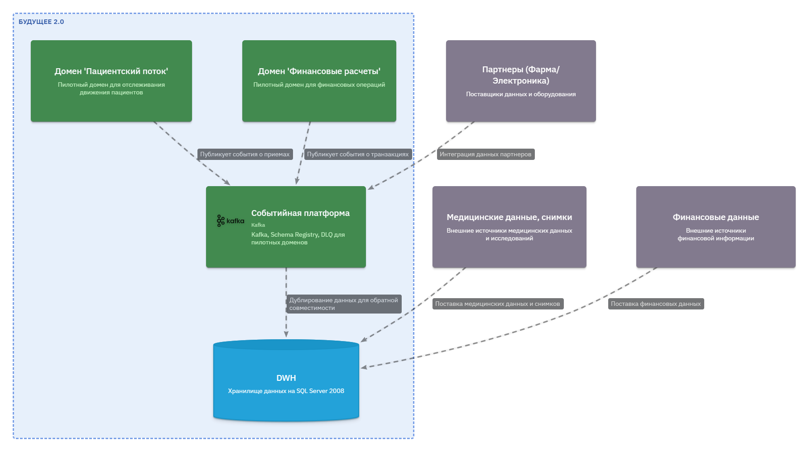
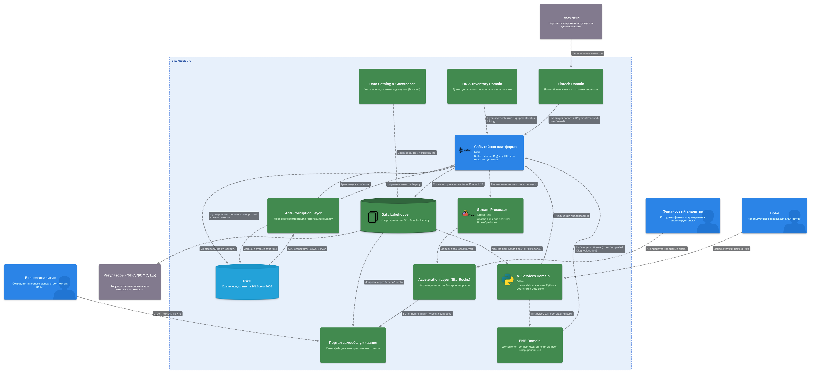
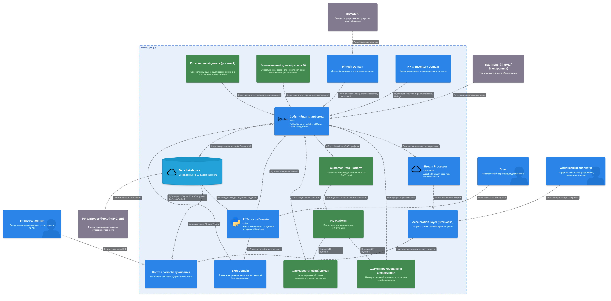
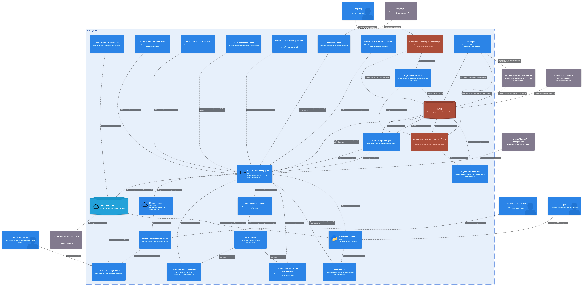

# Проектирование целевой архитектуры и оценка рисков внедрения

* Спроектируйте целевую архитектуру системы «Будущего 2.0» в горизонте трёх лет, используя C4-модель на уровне контейнеров и компонентов. Покажите, как изменятся ключевые системы компании при масштабировании, включая появление новых бизнес-направлений, интеграцию дополнительных источников данных и отказ от легаси-систем.
* Составьте карту рисков трансформации, определив архитектурные, организационные и технологические риски. Для каждого риска укажите вероятность его возникновения (низкая, средняя, высокая) и потенциальное влияние на бизнес (низкое, среднее, высокое).
* Предложите план управления рисками, описав конкретные меры по их снижению. Укажите, какие риски можно минимизировать с помощью технических решений, а какие — управленческими подходами.

## Ключевые архитектурные решения

### 1. C4

Детализация 1 год:

Детализация 2 год:

Детализация 3 год:

ToBe:

### 2. Карта рисков

**1. Архитектурные риски**

| ID     | Риск                                                | Описание                                                                                                                      | Вероятность | Влияние     | Стратегия снижения                                                                                                                   |
|--------|-----------------------------------------------------|-------------------------------------------------------------------------------------------------------------------------------|-------------|-------------|--------------------------------------------------------------------------------------------------------------------------------------|
| **A1** | **Потеря данных при миграции**                      | При переносе сотен терабайт из SQL Server 2008 в Data Lakehouse возможно частичное повреждение или потеря исторических данных | Средняя     | Высокое     | Многоэтапная миграция с верификацией чек-самм; резервное копирование; стратегия "сохранения оригинала" до полной уверенности         |
| **A2** | **Несовместимость схем событий**                    | Разные домены могут эволюционировать независимо, что приведет к несовместимости версий схем в Kafka                           | Высокая     | Среднее     | Обязательное использование Schema Registry с политикой совместимости (BACKWARD/ FORWARD); автоматические тесты совместимости в CI/CD |
| **A3** | **Задержки в near-real-time обработке**             | Переход от batch к потоковой обработке может не обеспечить требуемую latency для критических сценариев                        | Средняя     | Высокое     | Пилотирование на не критичных сценариях; мониторинг производительности Flink; возможность гибридной обработки (микро-батчи)          |
| **A4** | **Утечка медицинских данных в аналитическое озеро** | Нарушение требования об исключении медицинских карт из аналитики; риск компрометации чувствительных данных                    | Низкая      | Критическое | Строгая политика маскирования; автоматическая валидация на уровне CDC; шифрование; аудит доступа; регулярный compliance-скан         |
| **A5** | **Отказ антикоррупционного слоя**                   | ACL становится единой точкой отказа для всех интеграций с Legacy                                                              | Средняя     | Высокое     | Кластеризация ACL; автоматическое переключение; кэширование; деградация функциональности                                             |
| **A6** | **Недостаточная пропускная способность Kafka**      | Рост количества событий от новых доменов и партнеров может превысить возможности кластера                                     | Средняя     | Среднее     | Автомасштабирование; партиционирование; мониторинг lag; использование Confluent Cloud с гарантиями                                   |
| **A7** | **Несогласованность данных в CDP**                  | Customer Data Platform может содержать противоречивую информацию из-за eventual consistency                                   | Высокая     | Среднее     | Использоваление мастер-данных (MDM); внедрение механизмов дедупликации и сведения                                                    |
| **A8** | **Проблемы с геораспределенностью**                 | Задержки при синхронизации между регионами; требования локальных регуляторов к хранению данных                                | Высокая     | Высокое     | Федеративная архитектура с локальными инстансами; глобальный каталог; соблюдение data residency                                      |

**2. Технологические риски**

| ID     | Риск                                    | Описание                                                                                                   | Вероятность | Влияние | Стратегия снижения                                                                                                  |
|--------|-----------------------------------------|------------------------------------------------------------------------------------------------------------|-------------|---------|---------------------------------------------------------------------------------------------------------------------|
| **T1** | **Миграция с SQL Server 2008 (EOL)**    | Продукт с завершенной поддержкой; возможны проблемы совместимости при CDC; недокументированные особенности | Высокая     | Высокое | Поэтапная миграция; использование Debezium с тестированием на копии; дублирование записи в новое и старое хранилище |
| **T2** | **Сложность внедрения Data Mesh**       | Культурный и технологический шок для команд, привыкших к централизованному DWH                             | Высокая     | Высокое | Тренинги; наем Data Mesh-чемпионов; пилотный домен как образец; создание центров компетенций                        |
| **T3** | **Отказ от PowerBuilder**               | Бизнес-логика, зашитая в интерфейсе, может быть утеряна при миграции на React                              | Высокая     | Высокое | Обратный инжиниринг; создание тестовых сценариев; параллельная работа в течение 3-6 месяцев                         |
| **T4** | **Vendor lock-in облачного провайдера** | Зависимость от конкретного облака (AWS/Azure) при использовании managed-сервисов                           | Средняя     | Среднее | Мультиоблачная стратегия для критичных компонентов; использование открытых форматов (Iceberg); контейнеризация      |
| **T5** | **Сложность настройки Data Catalog**    | Пользователи не будут использовать каталог, данные останутся "невидимыми"                                  | Средняя     | Среднее | Интеграция с существующими инструментами; геймификация; обязательное документирование через CI/CD                   |
| **T6** | **Низкая производительность StarRocks** | Запросы к витрине могут не укладываться в SLA при росте числа пользователей                                | Низкая      | Среднее | Кэширование; агрегация на уровне Flink; горизонтальное масштабирование; мониторинг                                  |
| **T7** | **Безопасность API ИИ-сервисов**        | Открытые API для монетизации могут стать вектором атаки                                                    | Средняя     | Высокое | API Gateway; rate limiting; OAuth2; регулярный пентест; WAF                                                         |
| **T8** | **Потеря событий в DLQ**                | Dead Letter Queue может переполниться, события будут безвозвратно потеряны                                 | Средняя     | Среднее | Мониторинг DLQ; алертинг; автоматический ретрай; дашборд для ручной обработки                                       |

**3. Организационные риски**

| ID     | Риск                                          | Описание                                                                               | Вероятность | Влияние     | Стратегия снижения                                                                                          |
|--------|-----------------------------------------------|----------------------------------------------------------------------------------------|-------------|-------------|-------------------------------------------------------------------------------------------------------------|
| **O1** | **Сопротивление доменных команд**             | Команды не захотят брать ответственность за свои данные и публикацию событий           | Высокая     | Высокое     | Четкая система мотивации; демонстрация выгод; назначение владельцев продуктов (Data Product Owners)         |
| **O2** | **Недостаток компетенций**                    | Команды не имеют опыта работы с Kafka, Flink, Iceberg, Data Mesh                       | Высокая     | Среднее     | Массовое обучение; привлечение внешних экспертов; хакатоны; парное программирование                         |
| **O3** | **Конфликт приоритетов**                      | Развитие новых доменов vs поддержка Legacy (двойная нагрузка)                          | Высокая     | Высокое     | Выделение отдельных команд на миграцию; временное увеличение бюджета; четкий roadmap                        |
| **O4** | **Несоблюдение регуляторных требований**      | Медицинские и финансовые данные подпадают под строгие требования                       | Средняя     | Критическое | Вовлечение compliance-офицера с первого дня; аудит на каждом этапе; автоматизация проверок                  |
| **O5** | **Потеря критической бизнес-логики**          | Бизнес-логика, зашитая в DWH и PowerBuilder, может быть не полностью задокументирована | Высокая     | Критическое | Создание "библиотеки трансформаций"; интервью с ключевыми сотрудниками; тестирование на исторических данных |
| **O6** | **Неготовность пользователей к self-service** | Бизнес-пользователи продолжат просить отчеты у IT, игнорируя портал                    | Средняя     | Среднее     | Обучение; создание шаблонов; выделение "амбассадоров" в подразделениях                                      |
| **O7** | **Задержки в согласовании границ доменов**    | Долгие споры о том, где заканчивается один домен и начинается другой                   | Высокая     | Среднее     | Привлечение фасилитатора; быстрые решения на уровне пилотов; итеративное уточнение                          |
| **O8** | **Риск ухода ключевых сотрудников**           | Специалисты, знающие Legacy, могут уйти до завершения миграции                         | Средняя     | Высокое     | Программа удержания; документирование знаний; cross-training                                                |

**4. Матрица приоритетов (Probability x Impact)**

| Вероятность \ Влияние | Низкое | Среднее                    | Высокое        | Критическое |
|-----------------------|--------|----------------------------|----------------|-------------|
| **Высокая**           | T7, O6 | A2, A7, T2, T3, O2, O3, O7 | A8, T1, O1, O5 | -           |
| **Средняя**           | -      | A6, T4, T5, T8, O6         | A1, A3, A5, T7 | A4, O4      |
| **Низкая**            | -      | -                          | T6             | -           |

Критические риски (требуют немедленного внимания):

1. **A4** - Утечка медицинских данных
2. **O4** - Несоблюдение регуляторных требований

Риски с высокой вероятностью и высоким влиянием:

1. **A8** - Проблемы с геораспределенностью
2. **T1** - Миграция с SQL Server 2008
3. **T2** - Сложность внедрения Data Mesh
4. **T3** - Отказ от PowerBuilder
5. **O1** - Сопротивление доменных команд
6. **O5** - Потеря критической бизнес-логики

**5. Этапность возникновения рисков**

| Этап                   | Основные риски                 |
|------------------------|--------------------------------|
| **Этап 1 (0-6 мес)**   | T1, T2, T8, O2, O3, O7         |
| **Этап 2 (6-18 мес)**  | A2, A3, A5, T3, T5, O1, O4, O6 |
| **Этап 3 (18-36 мес)** | A6, A7, A8, T4, T7, O8         |

### 3. План управления рисков

**Матрица классификации мер**

| Тип мер | Описание | Примеры |
|---------|----------|---------|
| **Технические** | Реализуются через архитектуру, код, инфраструктуру | Резервное копирование, шифрование, автоматическое масштабирование |
| **Управленческие** | Реализуются через процессы, коммуникации, обучение | Назначение владельцев, тренинги, согласование границ |

**Архитектурные риски**

| Риск | Технические меры | Управленческие меры |
|------|-------------------|---------------------|
| **A1. Потеря данных при миграции** | • **Техника двойной записи**: одновременная запись в Legacy и новое хранилище в течение 3 месяцев • **Верификация чек-самм**: автоматическое сравнение контрольных сумм на выборочных данных • **Snapshot-стратегия**: полные дампы до и после миграции | • **Пилотная миграция**: перенос наименее критичного домена (например, инвентаризация) • **Формальный акт приёмки**: подписание бизнесом после верификации |
| **A2. Несовместимость схем событий** | • **Schema Registry с политикой BACKWARD_TRANSITIVE** • **Автотесты в CI/CD**: проверка совместимости при каждом изменении • **Contract Testing**: Pact-тесты между продюсерами и консьюмерами | • **Еженедельный совет по схемам** с представителями доменов • **Введение роли "Data Architect"**, утверждающего изменения схем |
| **A3. Задержки в near-real-time обработке** | • **Бенчмаркинг** производительности Flink на разных конфигурациях • **Гибридная архитектура**: микро-батчи (5-10 сек) для некритичных сценариев • **Автомасштабирование** Kafka Streams | • **SLA-сессии** с бизнесом: определение допустимых задержек по каждому сценарию • **Еженедельный мониторинг** дашбордов latency |
| **A4. Утечка медицинских данных** | • **Автоматическая маскировка** на уровне CDC Debezium • **Политики data masking** в Data Catalog • **Шифрование** AES-256 в покое и TLS 1.3 в движении • **Регулярный сканер** на наличие PII-полей в Data Lake | • **Compliance-комитет** с участием юристов и security • **Регулярный аудит** доступа к данным • **Обучение сотрудников** работе с чувствительными данными |
| **A5. Отказ антикоррупционного слоя** | • **Кластеризация ACL** (минимум 3 ноды) • **Автоматическое переключение** при отказе • **Кэширование** ответов (Redis) на 5-10 минут | • **SLA 99.9%** для ACL • **Регулярные учения** по отказоустойчивости |
| **A8. Проблемы с геораспределенностью** | • **Федеративная архитектура**: отдельные Kafka-кластеры в регионах • **Глобальный Schema Registry** для совместимости • **Data residency labels** в Data Catalog | • **Юридический анализ** требований каждого региона • **Назначение локальных compliance-офицеров** |

**Технологические риски**

| Риск | Технические меры | Управленческие меры |
|------|-------------------|---------------------|
| **T1. Миграция с SQL Server 2008** | • **Debezium CDC** с кастомными трансформациями • **Двойная запись** в течение 6 месяцев • **Shadow-тестирование**: сравнение результатов запросов | • **Поэтапный вывод**: сначала отчетные данные, потом операционные • **Программа удержания** экспертов по SQL Server |
| **T2. Сложность внедрения Data Mesh** | • **Data Product Template**: стандартизованный репозиторий для нового домена • **Self-service платформа** с автоматической генерацией топиков | • **Назначение "Data Mesh-чемпионов"** в каждом домене • **Еженедельные демо** успешных примеров • **Внешний аудитор** с опытом Data Mesh |
| **T3. Отказ от PowerBuilder** | • **Обратный инжиниринг**: генерация OpenAPI-спецификаций по экранам • **Параллельный запуск** старого и нового интерфейса 3 месяца • **Автоматическое логирование** всех действий операторов для валидации | • **Сессии с операторами** для сбора требований • **Super-user программа**: вовлечение ключевых операторов в тестирование |
| **T4. Vendor lock-in** | • **Открытые форматы**: Apache Iceberg, Parquet, Avro • **Инфраструктура как код** (Terraform) с абстракцией провайдера • **Мультиоблачные джобы** для критичных пайплайнов | • **Регулярный ревью** цен и возможностей провайдеров • **Стратегия exit plan** в документации |
| **T7. Безопасность API ИИ-сервисов** | • **API Gateway** с rate limiting и WAF • **OAuth2 + JWT** с коротким сроком жизни • **Мониторинг аномалий** (необычные паттерны запросов) | • **Регулярный пентест** (раз в полгода) • **Bug bounty программа** |
| **T8. Потеря событий в DLQ** | • **Мониторинг глубины DLQ** с алертами при 80% заполнения • **Автоматический ретрай** с exponential backoff • **Дашборд для ручной обработки** DLQ в Grafana | • **Назначение ответственного** за обработку DLQ (дежурства) • **Регламент разбора** DLQ: ежедневно в 10:00 |

**Организационные риски**

| Риск | Технические меры | Управленческие меры |
|------|-------------------|---------------------|
| **O1. Сопротивление доменных команд** | • **Прозрачные дашборды** с метриками успеха доменов • **Автоматическая оценка** качества данных (data quality scores) | • **KPI для руководителей**: % данных, опубликованных как события • **Бонусы** за успешную миграцию • **Roadshow** с демонстрацией выгод |
| **O2. Недостаток компетенций** | • **Песочница** с Kafka/Flink/Iceberg для самостоятельного обучения • **Шаблоны проектов** с best practices | • **Массовое обучение** (2 недели на домен) • **Сертификация** ключевых сотрудников • **Найм external-экспертов** на 6 месяцев |
| **O3. Конфликт приоритетов** | • **Автоматизация рутины** в Legacy для снижения нагрузки | • **Выделение отдельной команды** миграции • **Четкий roadmap** с согласованными ресурсами • **Еженедельный steering committee** |
| **O4. Несоблюдение регуляторных требований** | • **Автоматический контроль** compliance (например, проверка наличия шифрования) • **Data lineage** от источника до отчета | • **Включение юриста** в ежедневные стендапы • **Ежемесячный compliance-аудит** • **Внешний аудитор** перед запуском |
| **O5. Потеря критической бизнес-логики** | • **Создание "библиотеки трансформаций"** в Git • **Автоматическое тестирование** на исторических данных | • **Интервью с ключевыми сотрудниками** (запись видео) • **Парное программирование**: эксперт + новый разработчик |
| **O6. Неготовность пользователей к self-service** | • **Шаблоны отчетов** в портале • **Рекомендательная система**: "какие отчеты смотрят ваши коллеги" | • **Обучение пользователей** (workshops) • **Выделение "амбассадоров"** в подразделениях • **Геймификация**: рейтинг активных пользователей |
| **O7. Задержки в согласовании границ доменов** | • **Визуализация доменов** в Data Catalog • **Автоматическая проверка** пересечений данных | • **Фасилитатор** на встречах • **Принцип "быстрых побед"**: сначала простые границы |

**Сводная таблица "Кто отвечает"**

| Риск | Владелец риска | Частота мониторинга | Эскалация при |
|------|----------------|---------------------|---------------|
| **A1-A5, A8** | Архитектор данных | Еженедельно | Отклонение от плана миграции >10% |
| **T1-T4** | Tech Lead Legacy | Ежедневно (дашборды) | Рост числа инцидентов >5% |
| **T5-T8** | Platform Engineer | Ежедневно | Падение SLA ниже 99% |
| **O1-O3** | HR BP + Руководители доменов | Ежемесячно | Текучесть >15% в квартал |
| **O4** | Compliance Officer | Еженедельно | Любое подозрение на утечку |
| **O5** | Бизнес-аналитик | Еженедельно | Обнаружение недокументированной логики |
| **O6** | Product Owner портала | Еженедельно | Снижение MAU >20% |

#### Этапность внедрения мер

##### Этап 1 (0-6 месяцев)

1. **T1 (SQL Server)**: Настроить CDC и двойную запись
2. **T2 (Data Mesh)**: Запустить обучение и нанять external-экспертов
3. **T8 (DLQ)**: Настроить мониторинг и дашборд
4. **O2 (Компетенции)**: Провести первое массовое обучение
5. **O7 (Границы)**: Определить границы пилотных доменов
6. **A4 (Утечки)**: Настроить автоматическую маскировку

##### Этап 2 (6-18 месяцев)

1. **A2 (Схемы)**: Внедрить Schema Registry и автотесты
2. **A5 (ACL)**: Развернуть кластер и настроить кэширование
3. **T3 (PowerBuilder)**: Запустить параллельную работу
4. **O1 (Сопротивление)**: Внедрить KPI и бонусы
5. **O4 (Compliance)**: Включить юриста в стендапы
6. **O5 (Бизнес-логика)**: Провести интервью и создать библиотеку

##### Этап 3 (18-36 месяцев) - Целевое состояние

1. **A6 (Пропускная способность)**: Внедрить автомасштабирование
2. **A8 (Геораспределенность)**: Развернуть федеративную архитектуру
3. **T4 (Vendor lock-in)**: Провести ревью мультиоблачности
4. **T7 (API безопасность)**: Запустить bug bounty
5. **O6 (Self-service)**: Внедрить геймификацию
