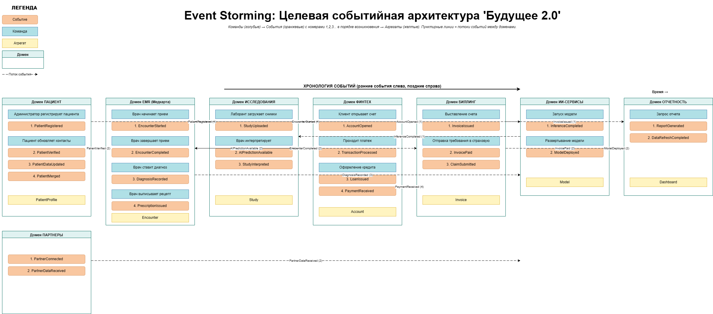

# Моделирование домена и интеграций

1. Разделите систему на домены с использованием подхода Domain-Driven Design (DDD). Определите bounded contexts для каждого домена и опишите ключевые агрегаты и события, которые будут играть важную роль при взаимодействии между доменами.
2. Опишите целевую событийную архитектуру, построив Event Storming-диаграмму или аналогичную схему. На диаграмме отразите основные события, публикуемые доменами. Например: «Создан кредитный договор», «Зарегистрирован новый пациент» или «Пройдено исследование ИИ». Укажите, какие домены выступают источниками этих событий, а какие —
   подписчиками.
3. Обоснуйте выбор событийного подхода, пояснив, какие преимущества он принесёт компании «Будущее 2.0». Опишите, как переход на интеграцию через события повысит гибкость, масштабируемость и скорость реакции системы по сравнению с текущей шиной Camel и DWH.

Когда задание будет готово, загрузите схему bounded contexts, Event Storming и аргументацию в директорию Task4Advanced в рамках пул-реквеста.

## Артефакты

| Файл                    | Содержание                                                         |
|-------------------------|--------------------------------------------------------------------|
| `bounded-contexts.md`   | Схема bounded contexts (Mermaid Context Map) + описание контекстов |
| `event-storming.drawio` | Event Storming диаграмма                                           |
| `aggregates.md`         | Полный каталог агрегатов                                           |
| `events.md`             | Каталог доменных событий                                           |
| `justification.md`      | Обоснование событийного подхода vs Camel ESB + DWH                 |

