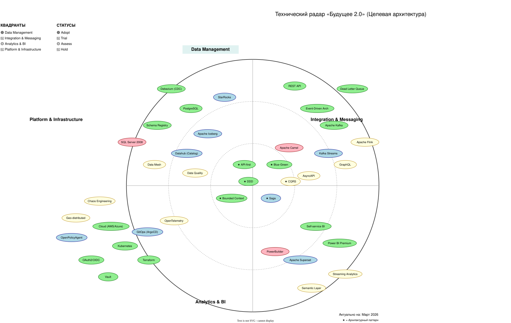

# Проектирование технологического стека и расчёт стоимости

1. Спроектируйте технологический ландшафт и выполните стоимостной анализ планируемых изменений. Сформируйте целевой
   технологический стек, составив расширенный технический радар, который должен включать не только технологии, но и
   архитектурные паттерны (например, Data Mesh, Event-Driven Architecture, Self-service BI). Для каждой технологии или
   паттерна укажите её текущий статус: Adopt, Trial, Assess или Hold.
2. Разработайте экономическое обоснование трансформации, описав модель TCO (Total Cost of Ownership) для текущей и
   целевой архитектуры. Укажите основные статьи затрат, включая инфраструктуру, лицензии, сопровождение, время
   аналитиков, и сравните их на горизонте трёх лет.
3. Составьте стратегический роадмап внедрения Data Mesh, указав ключевые роли, такие как Data Product Owner, Data
   Engineer и BI-аналитик. Опишите этапы внедрения, включая пилот, масштабирование и поддержку доменов, и привяжите их к
   основным бизнес-целям компании.

Когда задание будет готово, загрузите разработанный расширенный техрадар, TCO-анализ и роадмап в директорию
Task5Advanced.

Обратите внимание, что в репозитории есть директория /Task5/ с артефактами:
* `tech-radar.*` — расширенный технический радар (таблица, диаграмма или draw.io).
* `tco-analysis.*` — TCO-анализ (таблица или документ).
* `roadmap.*` — стратегический роадмап (диаграмма или таблица).

**Легенда квадрантов**

| Квадрант                      | Описание                                         |
|-------------------------------|--------------------------------------------------|
| **Data Management**           | Хранение, обработка и управление данными         |
| **Integration & Messaging**   | Интеграция, событийная шина, потоковая обработка |
| **Analytics & BI**            | Аналитика, отчетность, self-service              |
| **Platform & Infrastructure** | Облачная инфраструктура, DevOps, безопасность    |

**Легенда статусов**

| Статус     | Цвет    | Значение                                                                               |
|------------|---------|----------------------------------------------------------------------------------------|
| **Adopt**  | Зеленый | Технология готова к промышленному использованию, рекомендована для всех новых проектов |
| **Trial**  | Голубой | Пилотируется в одном-двух доменах, набираем опыт                                       |
| **Assess** | Желтый  | Изучается, возможна применимость, но требуется оценка                                  |
| **Hold**   | Красный | Не рекомендуется для новых проектов, постепенный вывод                                 |

**Ключевые решения по статусам**

| Технология          | Статус | Почему                                                                                               |
|---------------------|--------|------------------------------------------------------------------------------------------------------|
| **Data Mesh**       | Assess | Целевая архитектура, но требует зрелости команд. Начинаем с пилотных доменов и оцениваем результаты. |
| **Apache Kafka**    | Adopt  | Базовая технология для событийной платформы. Используется во всех новых проектах.                    |
| **SQL Server 2008** | Hold   | Критическое legacy. Только поддержка, новые проекты не стартуют.                                     |
| **Apache Flink**    | Assess | Мощный инструмент, но сложный. Требует пилота для оценки реальной пользы.                            |
| **StarRocks**       | Trial  | Выбран для ускорения запросов. Пилот на портале самообслуживания.                                    |
| **PowerBuilder**    | Hold   | Полностью выводится из эксплуатации.                                                                 |

**Дорожная карта внедрения**

| Период        | Фокус               | Ключевые технологии для внедрения            |
|---------------|---------------------|----------------------------------------------|
| **0-6 мес**   | Пилотные домены     | Kafka, Schema Registry, Debezium, PostgreSQL |
| **6-18 мес**  | Масштабирование     | Datahub, StarRocks, Iceberg, Flink (Trial)   |
| **18-36 мес** | Целевая архитектура | Data Mesh, Geo-distributed, OpenTelemetry    |

**Рекомендации по мониторингу радара**

1. **Пересматривать радар каждые 6 месяцев** на архитектурном комитете
2. **Технологии со статусом Trial** должны переходить в Adopt или Hold по итогам пилота
3. **Новые технологии** сначала попадают в Assess для изучения
4. **Hold-технологии** должны иметь план миграции

